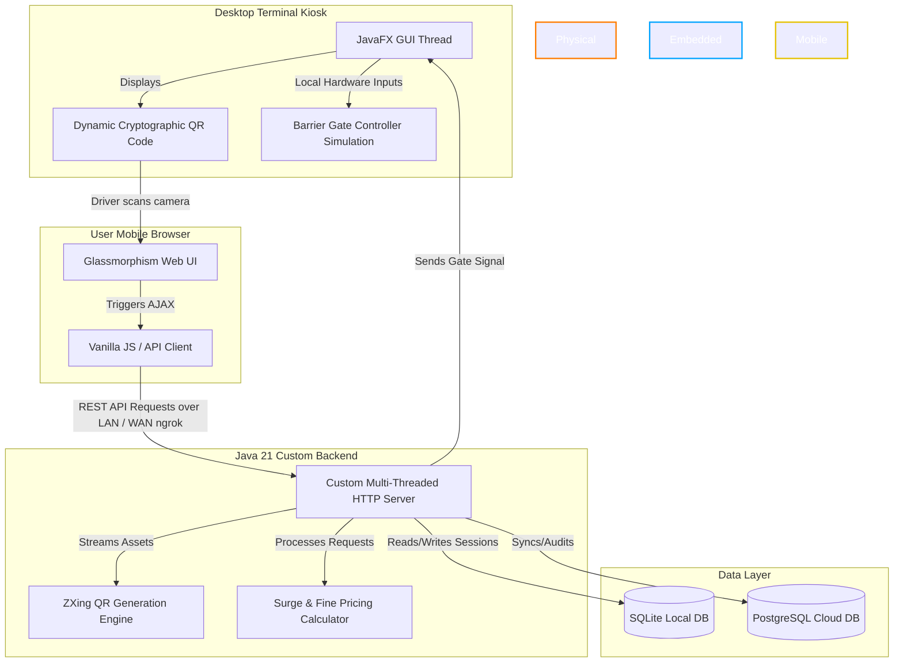

<div align="center">

# 🚗 SnapPark - Secure QR-Based Smart Parking Ecosystem

### **Zero-Install, Frictionless Parking Management System with Dynamic Surge Pricing & Cryptographic QR Ticketing**

[](https://jdk.java.net/)
[](https://openjfx.io/)
[](https://developer.mozilla.org/en-US/docs/Web/JavaScript)
[](#)
[](https://www.postgresql.org/)
[](LICENSE)

**No app installation. No paper ticketing. A secure, dynamic parking terminal built with Java 21, JavaFX, and lightweight web sockets.**

[Key Features](#-key-features) • [System Architecture](#-system-architecture) • [User Flow](#-user-flow-sequence) • [Surge Pricing Logic](#%EF%B8%8F-dynamic-surge-pricing-algorithm) • [Interactive Previews](#-terminal--mobile-ui-previews) • [Quick Start](#-getting-started)

---

</div>

## 📌 Project Concept & Problem
Traditional parking infrastructures suffer from high operational costs, paper ticket waste, and slow throughput during peak hours. Competitor systems force users to download proprietary mobile apps or sign up for complex profiles simply to pay for a 1-hour parking slot.

**SnapPark** bypasses these friction points. It features a standalone JavaFX-based physical Kiosk terminal with an integrated custom HTTP server. When a driver arrives, the Kiosk generates a cryptographically signed, dynamic QR code. The driver scans it and is immediately redirected to a responsive, web-based control panel on their phone's native browser to check in, track time, view live billing rates, and checkout securely — **completely offline or exposed globally via automated ngrok tunneling.**

---

## 🏗️ System Architecture

SnapPark is structured around a highly optimized desktop-server hybrid architecture. The Java application functions simultaneously as the physical GUI (Kiosk Screen) and the local web server.



---

## 🔄 User Flow Sequence

The sequence diagram below displays the lifecycle of a single parking session from arrival to gate checkout:

```mermaid
sequenceDiagram
    autonumber
    actor Driver as Parking Customer
    participant Kiosk as JavaFX Kiosk Screen
    participant Server as Custom Java HTTP Server
    participant DB as Relational Database
    participant Phone as Mobile Web UI (Safari/Chrome)

    Driver->>Kiosk: Drives up to Entrance
    Kiosk->>Server: Request New Token Session
    Server->>DB: Insert Initial Session (Status: PENDING_CHECKIN)
    Server->>Kiosk: Render Cryptographic QR (URL + Token ID)
    Driver->>Kiosk: Scans QR code with smartphone
    Phone->>Server: HTTP GET /session/{token_id}
    Server-->>Phone: Serve Responsive HTML5/JS Web Console
    
    Driver->>Phone: Clicks "CONFIRM CHECK-IN"
    Phone->>Server: POST /api/checkin (Verify GPS/Token)
    Server->>DB: Set Session ACTIVE (Record Timestamp)
    Server->>Kiosk: Trigger Entrance Gate Open Simulation
    Kiosk-->>Driver: Lift Barrier Gate & Show Welcome Screen
    
    rect rgb(20, 24, 33)
        note over Server, Phone: Active Parking Period (Real-Time Duration & Billing Tracking)
        Phone->>Server: GET /api/billing (Poll current charge)
        Server->>Server: Apply Occupancy-based Surge Pricing
        Server-->>Phone: Return live balance & time elapsed
    end
    
    Driver->>Phone: Clicks "CHECKOUT & PAY"
    Phone->>Server: POST /api/checkout (Process transaction)
    Server->>DB: Log Payment & Set Session CLOSED
    Server->>Kiosk: Trigger Exit Gate Open Simulation
    Kiosk-->>Driver: Lift Exit Barrier Gate (Teardown Session)
```



---

## ⚡ Dynamic Surge Pricing Algorithm
To optimize lot occupancy and maximize yield during high-demand hours, SnapPark implements an automated occupancy-based pricing model.

$$Rate = BaseRate \times \left(1 + \left(\frac{CurrentOccupancy}{TotalCapacity}\right)^2 \times SurgeMultiplier\right)$$

*   **Standard Rate:** Applies when occupancy is under 60%.
*   **Surge Tier 1:** (60% - 80% Occupancy) Multiplies base rate by **1.5x**.
*   **Surge Tier 2:** (80% - 100% Occupancy) Multiplies base rate by **2.2x** to throttle arrival rate.
*   **Overstay Fines:** An additional flat rate of **1.5x base hourly rate** is applied for every 15 minutes past the user's pre-selected exit reservation time.

---

## 📺 Terminal & Mobile UI Previews

To maintain absolute system portability and avoid bulky asset load times, the terminal layouts utilize a lightweight, custom CSS design system. The terminal dashboard and mobile controls render like this:

### 📟 JavaFX Desktop Terminal Layout (Console Mockup)
```
+------------------------------------------------------------------------+
|  [SNAPPARK] KIOSK ENTRY TERMINAL v1.0.2         LOT OCCUPANCY: [ 82% ]  |
+------------------------------------------------------------------------+
|                                                                        |
|    WELCOME DRIVER!                                                     |
|    To enter the parking lot, scan the dynamically generated QR code    |
|    below using your smartphone camera:                                 |
|                                                                        |
|                 +-----------------------------------+                  |
|                 |  ###############################  |                  |
|                 |  ##   *   *   *   *   *   *   ##  |                  |
|                 |  ##   *   #   #   #   #   *   ##  |                  |
|                 |  ##   *   #   *   *   #   *   ##  |                  |
|                 |  ##   *   #   #   #   #   *   ##  |                  |
|                 |  ##   *   *   *   *   *   *   ##  |                  |
|                 |  ###############################  |                  |
|                 +-----------------------------------+                  |
|                                                                        |
|    URL: http://192.168.1.15:8080/checkin?token=a8f9c1e7d2              |
|                                                                        |
+------------------------------------------------------------------------+
|  [GATE STATUS: CLOSED]                            [PRESS ESC TO ENTER]  |
+------------------------------------------------------------------------+
```

### 📱 User Mobile Browser UI Cards
```
+-----------------------------------+  +-----------------------------------+
|  [ 🚗 SNAPPARK PORTAL ]  [WiFi]   |  |  [ 🚗 SNAPPARK PORTAL ]  [WiFi]   |
+-----------------------------------+  +-----------------------------------+
|                                   |  |                                   |
|  ACTIVE VEHICLE SESSION           |  |  CHECKOUT & INVOICE SUMMARY       |
|  Status: ACTIVE 🟢                |  |  Session Status: PENDING_PAYMENT  |
|  -------------------------------  |  |  -------------------------------  |
|  Space Assigned:   B-24           |  |  Duration:          01h 45m       |
|  Check-In Time:    08:15 AM       |  |  Base Charge:       $4.50         |
|  Elapsed Time:     01h 12m        |  |  Surge Multiplier:  1.5x          |
|  Current Balance:  $6.75          |  |  Overstay Penalty:  $0.00         |
|  -------------------------------  |  |  -------------------------------  |
|  [!] Base rate surge of 1.5x is   |  |  TOTAL OUTSTANDING: $6.75         |
|      currently active.            |  |                                   |
|                                   |  |  [ SELECT PAYMENT METHOD ]        |
|  +-----------------------------+  |  |  [ 💳 DEBIT / CREDIT CARD ]       |
|  |       REQUEST CHECKOUT      |  |  |  [ 🪙 MOBILE PAY / UPI    ]       |
|  +-----------------------------+  |  |                                   |
+-----------------------------------+  +-----------------------------------+
```

---

## 🚀 Getting Started

### Prerequisites
Ensure your local environment includes the following globally mapped in your system environment variables `PATH`:
*   **Java Development Kit (JDK) 21** or higher. (`java -version` and `javac -version`)
*   **Apache Maven 3.8+** (`mvn -version`)
*   *(Optional)* **ngrok CLI** (`ngrok --version`) - Used to route QR codes globally over cellular networks.

### Installation & Launch
1. Clone the repository and navigate to the project directory:
   ```bash
   git clone https://github.com/rajmodi262/SnapPark-Smart-Parking.git
   cd SnapPark-Smart-Parking/snappark
   ```

2. **Mode 1: Offline / Local Area Network (LAN) Mode**  
   Use this if the Kiosk computer and user's phones are connected to the **same Wi-Fi router**.
   ```bash
   # Execute on Windows
   START_SNAPPARK.bat
   ```

3. **Mode 2: Global Internet Mode (ngrok Tunneling)**  
   Use this if the host PC is on home Wi-Fi and you want to test scanning from a phone connected to a mobile network (e.g., 5G/4G).
   ```bash
   # Execute on Windows
   START_PUBLIC.bat
   ```

---

## 📁 Repository Layout
```
SnapPark-Smart-Parking/
├── snappark/                     # Desktop Application & Core Server
│   ├── src/main/java/com/
│   │   ├── kiosk/                # JavaFX GUI Panels
│   │   ├── server/               # Custom HTTP Server & Controllers
│   │   └── database/             # SQLite & DB Connector
│   ├── START_SNAPPARK.bat        # LAN batch runner
│   ├── START_PUBLIC.bat          # ngrok WAN batch runner
│   └── pom.xml
├── snappark-web/                 # Responsive mobile portal assets
│   ├── index.html                # Entry portal
│   ├── app.js                    # AJAX & calculations
│   └── style.css                 # Glassmorphism design system
└── ENHANCEMENTS/                 # System reports & screenshots
```
